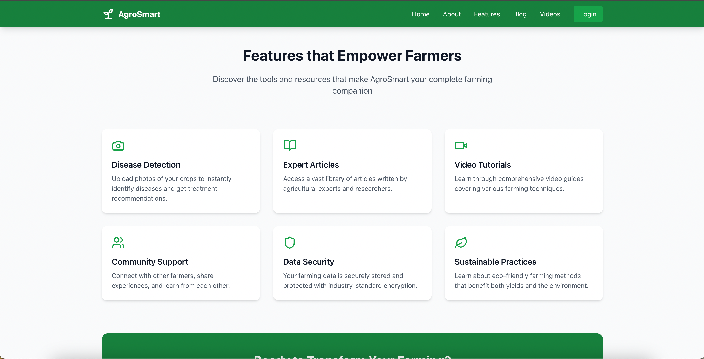
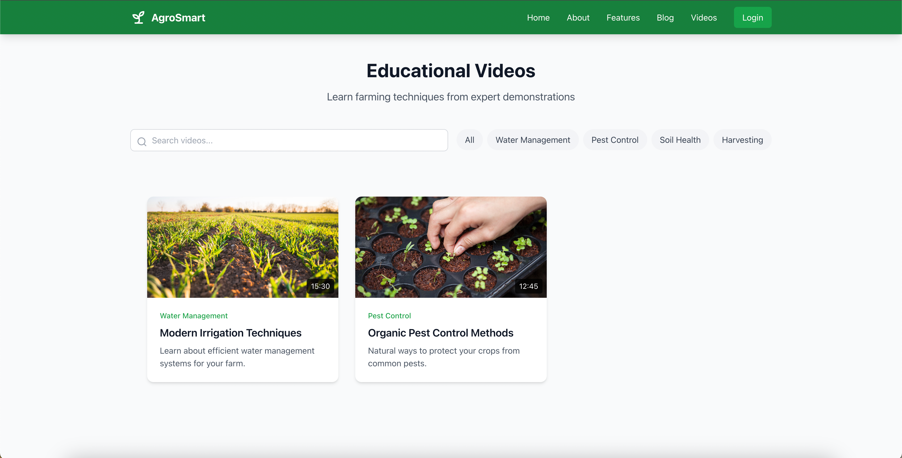
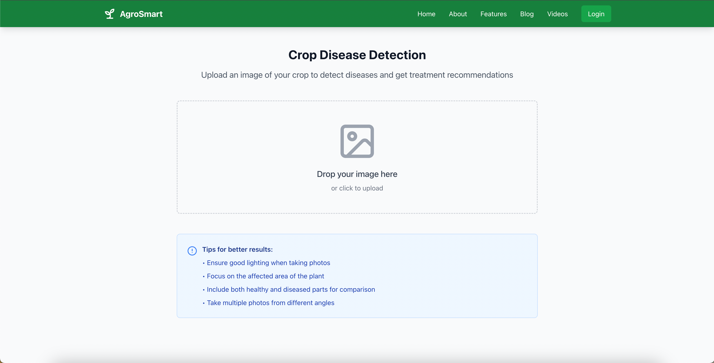
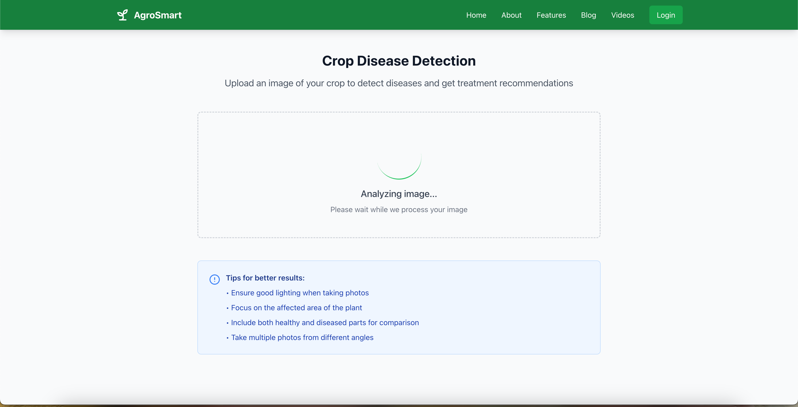

# AgroSmart Frontend

AgroSmart is a modern web application designed to empower farmers with real-time agricultural insights. The frontend repository provides the user interface for accessing weather data, crop prices, pest control tips, AI-driven crop disease diagnosis, and more. Built with a responsive design, AgroSmart ensures an intuitive and seamless experience across all devices.

## Features

- **Real-Time Agricultural Data**: View real-time information on weather, crop prices, pest control, and more.
- **AI-Powered Crop Disease Diagnosis**: Upload images to get AI-driven analysis of crop diseases.
- **Modern UI/UX**: A user-friendly and responsive design for web and mobile platforms.
- **Weather Updates**: Stay updated with the latest weather forecasts for better farming decisions.
- **Mobile and Web Compatibility**: Designed for both mobile and web, making it suitable for farmers in rural and urban areas.

## Tech Stack

- **React.js**: Used for building the user interface, providing a dynamic, component-based architecture.
- **Redux**: State management for seamless data flow and better performance.
- **React Router**: For handling routing and navigation.
- **Tailwind CSS**: Utility-first CSS framework for a fast, responsive, and customizable design.
- **Axios**: For making API requests to fetch data from the backend.
- **Cloudinary**: For storing and serving images for AI crop disease diagnosis.

## Installation

To run this project locally, follow the steps below:

### 1. Clone the repository

```bash
git clone https://github.com/Pushparaj13811/AgroSmart.git
```

### 2. Install dependencies

Navigate to the project directory and install dependencies using npm or yarn.

```bash
cd AgroSmart
npm install
# or
yarn install
```

### 3. Set up environment variables

Create a `.env` file in the root of the project and add the necessary environment variables (e.g., API URLs, third-party keys, etc.).

Example:

```
REACT_APP_API_URL=http://localhost:5000/api
```

### 4. Run the app

Start the development server:

```bash
npm run dev
# or
yarn run dev
```

Visit [http://localhost:5173](http://localhost:5173) in your browser to view the application.

## Screenshots

Here are some screenshots of the app:

### Home Page


### Features Page



### Video Library Page



### Blog Page


### Crop Disease Detection




### About Page


## Folder Structure

- **`/src`**: Contains all the frontend application code.
  - **`/components`**: Reusable React components (e.g., `WeatherCard`, `DiseaseDiagnosis`, etc.).
  - **`/pages`**: React components for each page (e.g., Home, Crop Diagnosis).
  - **`/services`**: API services for making requests to the backend.
  - **`/assets`**: Images, icons, and other static assets.
  - **`/store`**: Redux-related files (actions, reducers, and store configuration).

## Contributing

If you'd like to contribute to AgroSmart, feel free to fork the repository and submit a pull request. We welcome improvements, bug fixes, and feature enhancements.

### Steps to contribute:

1. Fork the repository
2. Create a new branch (`git checkout -b feature-name`)
3. Make your changes
4. Commit your changes (`git commit -m 'Add new feature'`)
5. Push to your branch (`git push origin feature-name`)
6. Submit a pull request

## License

This project is licensed under the MIT License - see the [LICENSE](LICENSE) file for details.

## Acknowledgments

- **React** and **React Router** for a powerful and flexible frontend framework.
- **Tailwind CSS** for a fast, responsive, and scalable design system.
- **Cloudinary** for seamless image storage and delivery.
- **OpenWeather API** for accurate and up-to-date weather data.
- **IBM Watson AI** for crop disease detection using machine learning.

---

### Notes:

- **API Integration**: This frontend depends on a backend API for real-time data and disease diagnosis. Ensure the backend is running and accessible for full functionality.
- **Responsive Design**: The app is designed to work seamlessly on both mobile and web devices. Make sure to test it across multiple screen sizes.

### Contact Details

- **Name**: Hompushparaj Mehta
- **Email**: pushparajmehta002@gmail.com

For any issues or feedback, feel free to raise an issue or contact us.